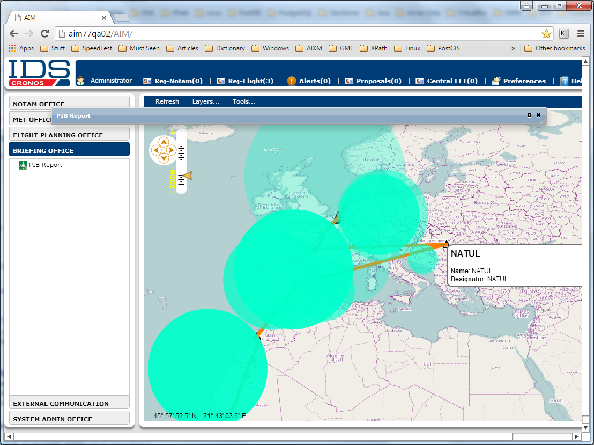
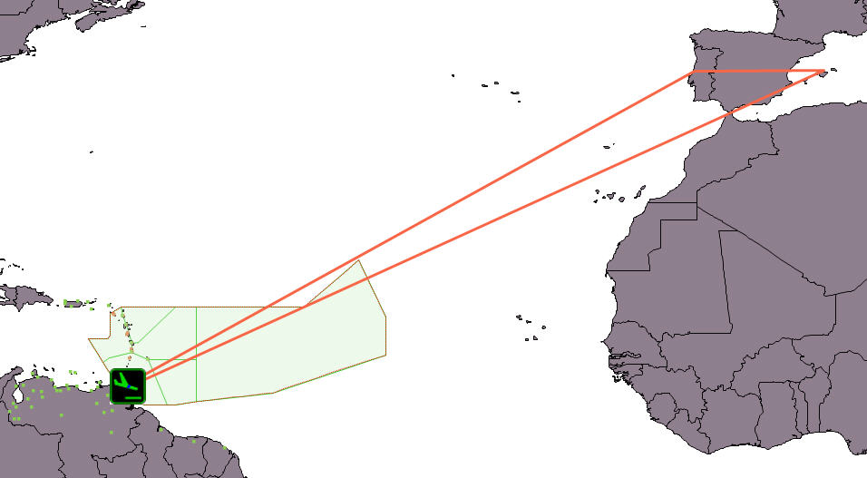

# DOCUMENT CONTROL
#### This page is for viewing by authorised IDS staff only.
#### No part of this publication including text, examples, diagrams, or illustrations may be reproduced, transmitted, or translated in any form or by any means, electronic, mechanical, manual, optical, or otherwise, for any purpose, without prior written permission of IDS North America Ltd.
# **CONTENT MAP**
## [Introduction](#introduction-1)
### ☺ [Parsing & interpretation a flight plan string](#1-parsing-interpretation-a-flight-plan-string-to-get)
* [**Sample Code #1**](#sample-code-1)

### ☺ [Parsing & interpretation a Surveillance route](#2-parsing-interpretation-a-surveillance-route)
* [**Sample Code #2**](#sample-code-2)

### ☺ [Intersection of a parsed & interpreted route with airspaces](#3-intersection-of-a-parsed-interpreted-route-with-airspaces)
* [**Sample Code #3**](#sample-code-3)

---
## [Classes Used in Intermediate and Final Results](#classes-used-in-intermediate-and-final-results-1)
### ☺ [RoutePoint Class](#routepoint-class)  
* [**Public Variables**](#public-variables)  
* [**Public Methods**](#public-methods)

### ☺ [RoutePointType Enum Class](#routepointtype-enum-class)  
* [**Public Enum Values**](#public-enum-values)

### ☺ [DisplayAttribute Class](#displayattribute-class)  
* [**Public Methods**](#public-methods-1)

### ☺ [RouteSegment Class](#routesegment-class)  
* [**Public Methods**](#public-methods-2)

### ☺ [RoutePortion Class](#routeportion-class)  
* [**Public Variables**](#public-variables-1)  
* [**Public Methods**](#public-methods-3)

---
## [Classes Implementing Route Interpretation Process](#classes-implementing-route-interpretation-process-1)
### ☺ [RouteFinder Class](#routefinder-class)  
* [**Public Constructors**](#public-constructors)
* [**Public Methods for Initialization & Reinitialization of Input Data**](#public-methods-for-initialization-reinitialization-of-input-data)
* [**Public Methods for Setting Parsing & Interpretation Process Parameters**](#public-methods-for-setting-parsing-interpretation-process-parameters)
 * [**Reasonable Settings for Batch vs Individual (Online) Route Processing**](#reasonable-settings-for-batch-vs-individual-online-route-processing)
* [**Public Methods for Calling Route Interpretation Process**](#public-methods-for-calling-route-interpretation-process)
* [**Public Methods for Retrieving Supplementary Output Results**](#public-methods-for-retrieving-supplementary-output-results)
* [**Public Memory Clean Up Method**](#public-memory-clean-up-method)

---
## [Classes Implementing Route Intersection with Airspaces](#classes-implementing-route-intersection-with-airspaces-1)
### ☺ [RPAirspace Class](#rpairspace-class)
### ☺ [RPAirspaceType Enum Class](#rpairspacetype-enum-class)
### ☺ [RouteAirspaceCollocationType Enum Class](#routeairspacecollocationtype-enum-class)
### ☺ [RouteAirspaceCollocation Class](#routeairspacecollocation-class)
* [**Public Methods for Initialization & Reinitialization of Input Data**](#public-methods-for-initialization-reinitialization-of-input-data-1)
* [**Public Methods for Route / Airspaces Intersection Identification**](#public-methods-for-route-airspaces-intersection-identification)
 * [**Adjustment Parameters of the Intersection Identification Algorithm**](#adjustment-parameters-of-the-intersection-identification-algorithm)
* [**Public Methods for Retrieving Supplementary Output Results**](#public-methods-for-retrieving-supplementary-output-results-1)
* [**Public Memory Clean Up Method**](#public-memory-clean-up-method-1)

---
## [Development of algorithms for correct interpretation of flight plans on the globe (Methodology)](#development-of-algorithms-for-correct-interpretation-of-flight-plans-on-the-globe-methodology-1)
### ☺ [Introduction](#introduction-2)
### ☺ [Flight path generation involves several tasks](#flight-path-generation-involves-several-tasks)
* [**Parsing a flight plan string**](#1-parsing-a-flight-plan-string)
* [**Searching the database for identifiers (designators)**](#2-searching-the-database-for-identifiers-designators)
* [**Recognition of circular (A-to-A) routes**](#3-recognition-of-circular-a-to-a-routes)

---

### [↑ To the Top of Content Map ↑](#content-map)

---

# Introduction

## ids.ROUTEPARSER package was designed to implement the following three basic functionalities:  

### 1. Parsing & interpretation a flight plan string to get:  
* Geographical path of the route in WKT format;
* List of [*RoutePoint*](#routepoint-class) instances, which represent consecutive nodes of the geographical path and provide an interface for accessing detailed information on each Node from Departure to Destination aerodrome;
* List of [*RoutePortion*](#routeportion-class) instances, which represent portions of an already found route path, and which differ by cruising level. The cruising/flight level change information is parsed/extracted from the original route string (flight plan).

See also [*Public Methods for Calling Route Interpretation Process*](#public-methods-for-calling-route-interpretation-process).

#### Sample Code #1

```java
// ======= DB-Connection Credentials =======
String url = "jdbc:postgresql://aim77qa03.idscorporation.ca/navdb";
String user = "navdb";
String password = "aftn";
java.sql.Connection connection = java.sql.DriverManager.getConnection (url, user, password);

// ======= Source Data for A-to-B Route =======
String departureAD = "FBKE";
String routeString = "FA UT429 IMDIV UT434 GSV";
String destinationAD[] = new String[] {"FBSK", "FBMN"};	// all aerodromes after the first one are alternate and optional in this array

// ======= Source Data for A-to-A Route =======
// To test A-to-A route: comment Strings for A-to-B (above) and uncomment Strings for A-to-A (below)

// String departureAD = "FBKE";
// String routeString = "FA UT429 IMDIV UT434 GSV UT434 IMDIV UT429 FA";
// String destinationAD[] = new String[] {"FBKE"}; 	// all aerodromes after the first one are alternate and optional in this array
String cruisingSpeedOrMachNumber = "K0830";	// cruising speed in terms of kilometres per hour, expressed as K followed by 4 figures
// Note: there are two other formats for cruising speed available
String elapsedTime = "0400";	// total estimated elapsed time in HHMM format
double routeLengthMaxToleranceCoeff = 1.5;
double maxRouteSegmentLengthInNM = 100.0;
// ======= End of Source Data =======

RouteFinder routeFinder = new RouteFinder(connection);
// Initialize Flight Plan data:
routeFinder.setNewFlightPlan(departureAD, routeString, destinationAD);
// Reinitialize internal java.sql.Timestamp variable if a specific time-slice for data-querying should be used:
routeFinder.setTimestamp("2017-01-01 00:00:00");
// Declare a LinkedList<String> for output WKTs:
LinkedList<String> listOfRouteWKTsForEachDestination;

if (routeFinder.isCircularRoute()) {
	listOfRouteWKTsForEachDestination = 
		routeFinder.getCircularRouteLineWKT(cruisingSpeedOrMachNumber, elapsedTime, routeLengthMaxToleranceCoeff, maxRouteSegmentLengthInNM);
}
else {
	listOfRouteWKTsForEachDestination = routeFinder.getRouteLineWKT();	// Default method version uses default process parameters
}
// Note that RouteFinder by default silently stores both non-fatal (route string format [syntactic or semantic]) errors 
// and critical errors into internal LinkedList<String> listOfErrorMessages.
// It may be worth to print all types of errors into a log-file even if the returned listOfRouteWKTsForEachDestination is not Null.
// All errors are printed into console here.
LinkedList<String> listOfErrorMessages = routeFinder.getListOfErrorMessages();

if (!(listOfErrorMessages == null || listOfErrorMessages.isEmpty())) {
	System.out.println("The following error messages were logged:");
	// Loop for printing error messages logged at a single (last) route interpretation process:
	for (String errMessage: listOfErrorMessages) {
		System.out.println(errMessage);
	}
}

if (listOfRouteWKTsForEachDestination != null) {	// when no fatal errors were faced
	int i = 0;
	// Loop for printing output route WKTs:
	for (String routeLineWKT: listOfRouteWKTsForEachDestination) {
		if (i == 0) {
			System.out.println("Departure-to-Destination Route WKT: " + routeLineWKT);
		}
		else {
			System.out.println("Departure-to-Alternate aerodrome #" + i + " Route WKT: " + routeLineWKT);
		}
		i++;
	}

	ArrayList<RoutePoint> routePoints = routeFinder.getLastFoundRouteStructure();	// Retrieval of supplementary (list of RoutePoint) results
	i = 0;
	// Loop for printing display name and other supplementary attributes of Route Points:
	for (RoutePoint routePoint: routePoints) {
		i++;
		System.out.println();
		System.out.println("Route Point #" + i + " attributes:");
		System.out.println("Display Name: " + routePoint.displayName);	// displayName is never Null
		for (DisplayAttribute displayAttribute: routePoint.getDisplayAttributes()) {
			System.out.println(displayAttribute.attributeName + ": " + displayAttribute.attributeValue);
		}
	}
}
// Do not forget to clean up the memory by closing RouteFinder instance at the end of the user session:
routeFinder.close();
```

[**↑ To the Content Map ↑**](#content-map)

### 2. Parsing & interpretation a *Surveillance route*.  
The specificity of such a route is that:
* It comes not from a flight plan, but from one of the following three possible sources: 
 * Radar Summary.
 * ATC Movement Log.
 * Tower Aircraft / Passenger Movement Log.
* It comes as a list of consecutive route-point-identifiers (at which a certain flight has been observed by surveillance equipment) and thus represents the actual flight path.
* Starting and ending route tokens can be given in any format corresponding to one of the elements of [*RoutePointType*](#routepointtype-enum-class) enumeration class. Note that *Waypoint five-letter name-code* and a *Navaid alphanumeric code* can be duplicated in the database (i.e. represent a number of different points on the globe), and therefore represent invalid (for this route) alternative locations. 

See also:
* [*String* **getSurveillanceRouteWKT(**_String_ **routeString**, _LinkedList\<String\>_ **airspaceWKTs)**](#getSurveillanceRouteWKT)  
and
* [*String* **getSurveillanceRouteWKT(**_String_ **routeString**, _LinkedList\<String\>_ **airspaceWKTs**, _double_ **bufferRadiusInMeters)**](#getSurveillanceRouteWKT-2)  
methods.

#### Sample Code #2

```java
// ======= DB-Connection Credentials =======
String url = "jdbc:postgresql://aim77qa03.idscorporation.ca/navdb";
String user = "navdb";
String password = "aftn";
java.sql.Connection connection = java.sql.DriverManager.getConnection (url, user, password);

// ======= Source Data =======
String routeString = "PTA DORVO BITAK ADA VTR CALVO KODOS TAROT YF BIMOG ECHED ADM ESS VTB NATUL DGO CNA VANAD VEKIN ADUTO FERDI DENUT";
LinkedList<String> airspaceWKTs = new LinkedList<String>();
airspaceWKTs.add("POLYGON((-58.53583333333333 -34.82222222222222, -58.53583333333333 51.23612222222222, 3.6576 51.23612222222222, 3.6576 -34.82222222222222, -58.53583333333333 -34.82222222222222))");
// ======= End of Source Data =======

// If RouteFinder instance has not been created yet:
RouteFinder routeFinder = new RouteFinder(connection);

String routeWKT = routeFinder.getSurveillanceRouteWKT(routeString, airspaceWKTs);

// Note that RouteFinder by default silently stores both non-fatal (route string format [syntactic or semantic]) errors 
// and critical errors into internal LinkedList<String> listOfErrorMessages.
// It may be worth to print all types of errors into a log-file even if the returned listOfRouteWKTsForEachDestination is not Null.
// All errors are printed into console here.
LinkedList<String> listOfErrorMessages = routeFinder.getListOfErrorMessages();

if (!(listOfErrorMessages == null || listOfErrorMessages.isEmpty())) {
	System.out.println("The following error messages were logged:");
	// Loop for printing error messages logged at a single (last) route interpretation process:
	for (String errMessage: listOfErrorMessages) {
		System.out.println(errMessage);
	}
}

if (routeWKT != null) {	// when no fatal errors were faced
	System.out.println("Route WKT: " + routeWKT);

	ArrayList<RoutePoint> routePoints = routeFinder.getLastFoundRouteStructure();	// Retrieval of supplementary (list of RoutePoint) results
	int i = 0;
	// Loop for printing display name and other supplementary attributes of Route Points:
	for (RoutePoint routePoint: routePoints) {
		i++;
		System.out.println();
		System.out.println("Route Point #" + i + " attributes:");
		System.out.println("Display Name: " + routePoint.displayName);	// displayName is never Null
		for (DisplayAttribute displayAttribute: routePoint.getDisplayAttributes()) {
			System.out.println(displayAttribute.attributeName + ": " + displayAttribute.attributeValue);
		}
	}
}
// Do not forget to clean up the memory by closing RouteFinder instance at the end of the user session:
routeFinder.close();
```

[**↑ To the Content Map ↑**](#content-map)

### 3. Intersection of a parsed & interpreted route with airspaces.  
Start and/or end [*RoutePoint*](#routepoint-class) instances of intersecting route portions can represent either 
* An existing route-point (when the route crosses an airspace border vertex, based on that waypoint location), or
* A geographical location at which one of the route segments intersects one of the airspace border segments.

See also [**_RouteAirspaceCollocation Class_**](#routeairspacecollocation-class) and overloaded [**_resolveCollocation(...)_**](#resolveCollocation-2) method with useful parameters.

#### Sample Code #3

```java
// ======= FOR TESTING PURPOSES PLACE THIS SAMPLE CODE BELOW EITHER SAMPLE CODE #1 OR SAMPLE CODE #2 =======
// ======= DELETE “routeFinder.close();” LINE AT THE BOTTOM OF THE PREVIOUS SAMPLE CODE =======
// Initialize source String airspaceWKT
String airspaceWKT = "MULTIPOLYGON(((20 -24.7666666666667,20.0044444444444 -21.9947222222222,21.0066666666667 -21.9991666666667,21 -18.325,21.4527888888889 -18.3174,23.0987444444444 -18.000925,23.2970805555556 -18.0004888888889,23.3992972222222 -18.200225,23.49905 -18.2433805555556,23.5567472222222 -18.3365666666667,23.5600416666667 -18.3919972222222,23.5686805555556 -18.4780416666667,23.6163861111111 -18.5010305555556,23.6856361111111 -18.4316388888889,23.7723694444444 -18.3895527777778,23.8046277777778 -18.33845,23.9323 -18.2420916666667,23.9208722222222 -18.2236194444444,24.0494611111111 -18.1362277777778,24.0526361111111 -18.110375,24.0879083333333 -18.1198833333333,24.19465 -18.0186277777778,24.2362361111111 -18.0250472222222,24.2695416666667 -18.0118083333333,24.2945 -18.0357138888889,24.3045222222222 -18.0087472222222,24.36925 -17.9517083333333,24.4479888888889 -17.9699972222222,24.5061777777778 -18.0618944444444,24.5748694444444 -18.0729805555556,24.6178916666667 -17.9944638888889,24.6679694444444 -17.9493972222222,24.7412472222222 -17.8847527777778,24.8771444444444 -17.8376055555556,24.8899472222222 -17.8281972222222,24.893 -17.829825,24.8972777777778 -17.8275972222222,24.8989944444444 -17.8303416666667,24.9039444444444 -17.8270472222222,24.9102888888889 -17.8104444444444,24.9129944444444 -17.8103083333333,24.9154194444444 -17.8147444444444,24.9177305555556 -17.8144777777778,24.919575 -17.8122666666667,24.9212888888889 -17.8114361111111,24.9248583333333 -17.8137222222222,24.9278361111111 -17.8137777777778,24.9281833333333 -17.8122305555556,24.9263166666667 -17.8098472222222,24.9265305555556 -17.8089555555556,24.9292611111111 -17.8090888888889,24.9308083333333 -17.8122,24.9302111111111 -17.8132555555556,24.9302083333333 -17.8152972222222,24.93315 -17.8162055555556,24.9336888888889 -17.8171027777778,24.9312833333333 -17.8178611111111,24.9300861111111 -17.8190861111111,24.9304416666667 -17.8200916666667,24.9342694444444 -17.8184805555556,24.9366722222222 -17.8146944444444,24.9393333333333 -17.8106972222222,24.94945 -17.8035861111111,24.9532166666667 -17.8020861111111,24.9537333333333 -17.8003861111111,24.9527666666667 -17.7969527777778,24.957975 -17.7894916666667,24.9617638888889 -17.7876388888889,24.9684527777778 -17.7893694444444,24.9759416666667 -17.7881888888889,24.9799666666667 -17.789775,24.9822388888889 -17.7953722222222,24.9789055555556 -17.7984416666667,24.9733916666667 -17.7985277777778,24.9708916666667 -17.8008805555556,24.9678138888889 -17.8008055555556,24.9657583333333 -17.8016777777778,24.9652222222222 -17.8079527777778,24.9707111111111 -17.8110861111111,24.9741805555556 -17.8099555555556,24.9794083333333 -17.8115833333333,24.9809555555556 -17.8156194444444,24.9763611111111 -17.8180583333333,24.9749694444444 -17.820175,24.97605 -17.8224583333333,24.9755694444444 -17.8243833333333,24.9764722222222 -17.8257861111111,24.9868638888889 -17.8263583333333,24.9932916666667 -17.8299166666667,24.9952305555556 -17.8282583333333,24.9984194444444 -17.8169444444444,25.0057972222222 -17.8160111111111,25.0101888888889 -17.8207777777778,25.0096944444444 -17.8254305555556,25.0073833333333 -17.8269111111111,25.0070194444444 -17.8261222222222,25.0045444444444 -17.8242694444444,25.0007583333333 -17.8269694444444,24.9998166666667 -17.8307333333333,25.0031083333333 -17.833725,25.0045305555556 -17.8371972222222,25.0118611111111 -17.8383333333333,25.0194083333333 -17.834875,25.0194333333333 -17.8311972222222,25.0368833333333 -17.8202388888889,25.0508527777778 -17.8079777777778,25.0594888888889 -17.8109666666667,25.0616194444444 -17.8265555555556,25.058025 -17.8306,25.0545972222222 -17.8284888888889,25.050475 -17.82795,25.0494944444444 -17.83135,25.0658194444444 -17.8408444444444,25.0775194444444 -17.8387944444444,25.0962722222222 -17.8308833333333,25.1161111111111 -17.8257722222222,25.12235 -17.8164305555556,25.1267944444444 -17.8036166666667,25.1318027777778 -17.8010388888889,25.1405555555556 -17.8079888888889,25.1444916666667 -17.8071333333333,25.1595833333333 -17.7794277777778,25.1744555555556 -17.7794777777778,25.2225944444444 -17.7944166666667,25.235975 -17.7915916666667,25.2583333333333 -17.7916666666667,25.2266666666667 -17.8666666666667,25.315 -18.0683333333333,25.3666666666667 -18.1083333333333,25.3916666666667 -18.1186111111111,25.4952777777778 -18.3047222222222,25.5141666666667 -18.3761111111111,25.6 -18.4780555555556,25.6391666666667 -18.495,25.6597222222222 -18.5247222222222,25.6858333333333 -18.5741666666667,25.77 -18.6136111111111,25.8286111111111 -18.7938888888889,25.9436111111111 -18.8908333333333,25.9833333333333 -18.98,25.9625 -19.0988888888889,26.0394444444444 -19.2,26.1666666666667 -19.5266666666667,26.2591666666667 -19.5741666666667,26.3 -19.5711111111111,26.3569444444444 -19.6136111111111,26.3266666666667 -19.6533333333333,26.4033333333333 -19.6719444444444,26.4305555555556 -19.7225,26.4936111111111 -19.7425,26.5944444444444 -19.8016666666667,26.6194444444444 -19.8602777777778,26.7036111111111 -19.8769444444444,26.735 -19.9305555555556,26.8013888888889 -19.9394444444444,26.9786111111111 -20.0097222222222,27.0208333333333 -20,27.0744444444444 -20.0194444444444,27.1133333333333 -20.0622222222222,27.2302777777778 -20.0908333333333,27.3041666666667 -20.2969444444444,27.3 -20.3416666666667,27.2833333333333 -20.4877777777778,27.3566666666667 -20.4652777777778,27.6861111111111 -20.4858333333333,27.7261111111111 -20.5244444444444,27.705 -20.5938888888889,27.7283333333333 -20.7016666666667,27.6883333333333 -21.0791666666667,27.8458333333333 -21.2275,27.9752777777778 -21.4452777777778,27.9752777777778 -21.485,28.0211111111111 -21.5652777777778,28.2466666666667 -21.5833333333333,28.2869444444444 -21.585,28.5 -21.6622222222222,28.5705555555556 -21.6316666666667,28.9297222222222 -21.7666666666667,28.9861111111111 -21.77,29.05 -21.7938888888889,29.0833333333333 -21.8216666666667,29.1833333333333 -21.9333333333333,29.255 -22.0622222222222,29.3722222222222 -22.1877777777778,29.3305555555556 -22.2,29.2241666666667 -22.1811111111111,29.0222222222222 -22.2275,28.9583333333333 -22.3158333333333,28.9658333333333 -22.385,28.9136111111111 -22.4561111111111,28.8411361111111 -22.4577027777778,28.8294444444444 -22.4561111111111,28.8294444444444 -22.4877777777778,28.7241666666667 -22.5116666666667,28.6333333333333 -22.5641666666667,28.5530555555556 -22.5641666666667,28.535 -22.5833333333333,28.3736111111111 -22.575,28.1919444444444 -22.6761111111111,28.1936111111111 -22.7719444444444,28.0416666666667 -22.8413888888889,28.0416666666667 -22.9116666666667,27.9708333333333 -22.9555555555556,27.9411111111111 -22.9561111111111,27.9419444444444 -23.0433333333333,27.8183333333333 -23.1275,27.7597222222222 -23.2166666666667,27.6022222222222 -23.2186111111111,27.5691666666667 -23.3266666666667,27.5266666666667 -23.3833333333333,27.3416666666667 -23.3958333333333,26.9738888888889 -23.6927777777778,26.8452777777778 -24.2666666666667,26.7255555555556 -24.3066666666667,26.5291666666667 -24.4666666666667,26.4769444444444 -24.5641666666667,26.4097222222222 -24.6325,26.38 -24.6452777777778,26.3 -24.6583333333333,25.8686111111111 -24.7425,25.8772222222222 -24.8908333333333,25.8072222222222 -25.1,25.7944444444444 -25.11,25.7608333333333 -25.2275,25.7302777777778 -25.2572222222222,25.6813888888889 -25.4483333333333,25.5880555555556 -25.6236111111111,25.37 -25.7522222222222,25.366625 -25.757825,25.1516666666667 -25.7622222222222,25.0325 -25.7255555555556,25 -25.7388888888889,24.895 -25.8116666666667,24.7033333333333 -25.8138888888889,24.6925 -25.8286111111111,24.4463888888889 -25.7363888888889,24.3752777777778 -25.7622222222222,24.1908333333333 -25.6236111111111,24 -25.6561111111111,24.0094444444444 -25.6275,23.9136111111111 -25.6333333333333,23.8094444444444 -25.5244444444444,23.5325 -25.3363888888889,23.5 -25.3363888888889,23.4780555555556 -25.2908333333333,23.4333333333333 -25.2908333333333,23.3366666666667 -25.27,23.1813888888889 -25.2652777777778,23.1302777777778 -25.2988888888889,23.0138888888889 -25.2988888888889,22.9105555555556 -25.395,22.8183333333333 -25.5641666666667,22.8202777777778 -25.6633333333333,22.7333333333333 -25.7919444444444,22.7716666666667 -25.8286111111111,22.7091666666667 -25.8858333333333,22.7236111111111 -25.97,22.5272222222222 -26.2255555555556,22.4833333333333 -26.2,22.3327777777778 -26.3244444444444,22.1975 -26.3919444444444,22.1580555555556 -26.5036111111111,22.0436111111111 -26.6333333333333,21.9580555555556 -26.6633333333333,21.8666666666667 -26.6622222222222,21.7613888888889 -26.6858333333333,21.7833333333333 -26.7877777777778,21.6625 -26.8625,21.5305555555556 -26.8563888888889,21.3966666666667 -26.8208333333333,21.1227777777778 -26.8702777777778,21.0266666666667 -26.8241666666667,20.8919444444444 -26.7938888888889,20.6919444444444 -26.8908333333333,20.6788888888889 -26.8483333333333,20.6430555555556 -26.8286111111111,20.6027777777778 -26.6908333333333,20.6325 -26.5938888888889,20.6027777777778 -26.5541666666667,20.6 -26.5,20.6119444444444 -26.4522222222222,20.6658333333333 -26.4158333333333,20.8611111111111 -26.1363888888889,20.7116666666667 -25.8236111111111,20.6541666666667 -25.6166666666667,20.6877777777778 -25.5969444444444,20.6302777777778 -25.5294444444444,20.6411111111111 -25.4819444444444,20.6086111111111 -25.3958333333333,20.5586111111111 -25.3858333333333,20.3877777777778 -25.0352777777778,20.2475 -24.9205555555556,20.1716666666667 -24.8833333333333,20.1325 -24.8833333333333,20 -24.7666666666667)))";

// Instantiate LinkedList<RPAirspace> rpAirspaces
LinkedList<RPAirspace> rpAirspaces = new LinkedList<RPAirspace>();
// Add a new instance of RPAirspace Class to rpAirspaces
rpAirspaces.add(new RPAirspace(airspaceWKT, RPAirspaceType.FIR));
// Note that unlimited number of RPAirspace instances can be added for intersection check
// RPAirspace instance stores both airspace shape in WKT-format and its type, specified through RPAirspaceType Enumeration
// RPAirspace is able to parse / recognize only two shape types in WKT-format. They are POLYGON and MULTIPOLYGON
// Only two types of airspaces (FIR and TMA) can be used for route / airspace intersection search

// Create a RouteAirspaceCollocation instance
RouteAirspaceCollocation routeAirspaceCollocation = new RouteAirspaceCollocation(connection);
// Initialize routeAirspaceCollocation by already parsed & interpreted route provided by routeFinder instance from either Sample Code #1 or #2
routeAirspaceCollocation.setRouteStructure(routeFinder.getLastFoundRouteStructure());
// Initialize routeAirspaceCollocation by list of RPAirspace instances
routeAirspaceCollocation.setAirspaces(rpAirspaces);

// Launch resolveCollocation() method. Note that default method version uses default process parameters
RouteAirspaceCollocationType routeAirspaceCollocationType = routeAirspaceCollocation.resolveCollocation();

// Print the type of identified intersection
System.out.println("");
System.out.println("Collocation Type: " + routeAirspaceCollocationType.name());

// Check if the output routeAirspaceCollocationType enum-value is one of the intersection ones (OVERFLIGHT, ARRIVAL, DEPARTURE, DOMESTIC)
// Note all these intersection enum-values follow right after DISJOINT value and have a greater ordinal
if (routeAirspaceCollocationType.ordinal() <= RouteAirspaceCollocationType.DISJOINT.ordinal()) {
	System.out.println("Route and Airspace(s) do Not intersect");
}
else {
	// This code runs when route-line intersects with at least one of the input airspace-polygons
	int i = 0;
	// This is the basic way to get intersecting Route Segments, which are returned directly by routeAirspaceCollocation instance.
	// Loop for printing attributes of intersecting Route Segments
	for (RouteSegment routeSegment: routeAirspaceCollocation.getRouteSegments()) {
		i++;
		System.out.println();
		System.out.println("Route Segment #" + i + " connects:");
		System.out.println(routeSegment.getStartRoutePoint().displayName + " AND " + routeSegment.getEndRoutePoint().displayName);
		System.out.println("Route Segment length: " + routeSegment.getLengthInKM().toString() + " KM");
	}

	// The code below shows how first to get intersecting RoutePortion instances, 
	// and then using RoutePortion interfaces to get RoutePoint and RouteSegment instances constituting each of those Route Portions.
	i = 0;
	// Loop for printing each intersecting Route Portion WKT, its length, constituting Route Points and Segments
	for (RoutePortion routePortion: routeAirspaceCollocation.getRoutePortions()) {
		i++;
		System.out.println("");
		System.out.println("Intersecting Route Portion #: " + i + " attributes");
		System.out.println("Route Portion WKT: " + routePortion.getRouteWKT());
		System.out.println("Route Portion Length: " + routePortion.getLengthInKM().toString() + " KM");

		int j = 0;
		// Loop for printing display name and other supplementary attributes of Route Points within intersecting Route Portion
		for (RoutePoint routePoint: routePortion.getRoutePoints()) {
			j++;
			System.out.println();
			System.out.println("Route Point #" + j + " attributes:");
			System.out.println("Display Name: " + routePoint.displayName);	// displayName is never Null
			for (DisplayAttribute displayAttribute: routePoint.getDisplayAttributes()) {
				System.out.println(displayAttribute.attributeName + ": " + displayAttribute.attributeValue);
			}
		}

		j = 0;
		// Loop for printing attributes of Route Segments within intersecting Route Portion
		for (RouteSegment routeSegment: routePortion.getRouteSegments()) {
			j++;
			System.out.println();
			System.out.println("Route Segment #" + j + " connects:");
			System.out.println(routeSegment.getStartRoutePoint().displayName + " AND " + routeSegment.getEndRoutePoint().displayName);
			System.out.println("Route Segment length: " + routeSegment.getLengthInKM().toString() + " KM");
		}
	}
}
```

[**↑ To the Content Map ↑**](#content-map)

---
# Classes Used in Intermediate and Final Results

## RoutePoint Class
**RoutePoint** class is to represent any type of route point, used in a Route String as per [ICAO Doc.4444](http://www.icao.int/airnavigation/Lists/T_Documents/DispForm.aspx?ID=83) specification (see Appendix 2 *Flight Plan*, ITEM 15: *ROUTE*). It provides methods to extract point coordinates, type, designator (if exists), display name (the most representative text for labeling a point on the interactive map), etc.
### Public Variables
* *String* **designator** - designator or *ident* attribute value of a feature retrieved from the database.  
**Note:** It can be NULL for *non-database* route points.
* [*RoutePointType*](#routepointtype-enum-class) **pointType** - one of route point types, represented in [*RoutePointType*](#routepointtype-enum-class) enumeration class.

### Public Methods
* *Double* **getLatitude()** - returns Latitude value (in decimal degrees) of the route point geographical location.  
**Note:** It can never return NULL.
* *Double* **getLongitude()** - returns Longitude value (in decimal degrees) of the route point geographical location.  
**Note:** It can never return NULL.
* <a name= "getDisplayName"></a>*String* **getDisplayName()** - returns the most representative text for the Title of the point Label to be displayed on the interactive map (for instance).  
**Note:** It can never return NULL.  
There is the following priority of route point attributes, used by this method.  
If a higher priority attribute is NULL, the next lower priority attribute will be returned:
 1. feature **_name_** attribute, extracted from the DB for *database-route-points*.
 2. feature **_identifier_** or **_designator_** attribute, extracted from the DB for *database-route-points* (normally used when **_name_** attribute is empty in the DB).
 3. **_parsed route string token as is_** (normally used for *non-database-route-points*).

* *[ArrayList](http://docs.oracle.com/javase/8/docs/api/java/util/ArrayList.html)\<[DisplayAttribute](#displayattribute-class)\>* **getDisplayAttributes()** - returns a list of [*DisplayAttribute*](#displayattribute-class) instances, which would be helpful if supplement the point-related Label Title on the interactive map (for instance).  
**Note:** None of returned attributes repeats the attribute, returned by [_String **getDisplayName()**_](#getDisplayName) method for a particular [*RoutePoint*](#routepoint-class) instance.

[**↑ To the Content Map ↑**](#content-map)

---
## RoutePointType Enum Class
**RoutePointType** enum class is to regulate all possible types of [*RoutePoint*](#routepoint-class) class instances, which are used in the intermediate and final results of methods, implemented in the ROUTEPARSER package.
### Public Enum Values
* <a name= "RoutePointType.OTHER"></a>**OTHER** - represents any [*RoutePoint*](#routepoint-class) instance, which is not a designated part of a route. This type is particularly used to specify a route-to-airspace border intersection point, returned by methods implemented in [*RouteAirspaceCollocation*](#routeairspacecollocation-class) class.
* **ADHP** - represents *AirportHeliport* type of [*RoutePoint*](#routepoint-class) instance.
* **Waypoint** - represents *Waypoint* type of [*RoutePoint*](#routepoint-class) instance.  
This can be a *Significant point* in one of the following formats:  
 * Five-letter pronounceable *name-code*, e.g. ADOLA (see Annex 11, Appendix 2).
 * Degrees only (7 characters), e.g. 46N078W.
 * Degrees and minutes (11 characters), e.g. 4620N07805W.
 * Degrees, minutes and seconds (15 characters), e.g. 462010N0780520W.
* **DME** - represents *Distance Measurement Equipment* navaid type of [*RoutePoint*](#routepoint-class) instance, which can appear in the following format [A-Z0-9]{2}|[A-Z]{3}.
* **Marker** - represents *Marker Beacon* navaid type of [*RoutePoint*](#routepoint-class) instance, which can appear in the following format [A-Z0-9]{2}|[A-Z]{3}.
* **NDB** - represents *Non-Directional Beacon* navaid type of [*RoutePoint*](#routepoint-class) instance, which can appear in the following format [A-Z0-9]{2}|[A-Z]{3}.
* **TACAN** - represents *TACtical Air Navigation system* navaid type of [*RoutePoint*](#routepoint-class) instance, which can appear in the following format [A-Z0-9]{2}|[A-Z]{3}.
* **VOR** - represents *VHF Omni Directional Radio Range* navaid type of [*RoutePoint*](#routepoint-class) instance, which can appear in the following format [A-Z0-9]{2}|[A-Z]{3}.

**Note:**  
* **DME, Marker, NDB, TACAN** and **VOR** types can also appear in the following extended format:
 * Bearing and distance from a navigation aid, e.g. a point 180° magnetic at a distance of 40 nautical miles from VOR *DUB* is expressed as DUB180040.
* **Waypoint, DME, Marker, NDB, TACAN** and **VOR** types can also appear in the following extended formats:
 * Change of speed or level, e.g. HADDY/N0420F330, 4602N07805W/N0500F350, 46N078W/M082F330.
 * Change of flight rules, e.g. HELEN VFR, 46N078W IFR.
 * Cruise climb, e.g. C/48N050W/M082F290F350, C/48N050W/M082F290PLUS, C/52N050W/M220F580F620.

[**↑ To the Content Map ↑**](#content-map)

---
## DisplayAttribute Class
**DisplayAttribute** class is to store a couple of strings: *attribute name* and *attribute value*.  
**Note:** This class was originally designed to represent supplementary [*RoutePoint*](#routepoint-class) information, which would add the most representative set of attributes to a route point depending on its type.
### Public Methods
* *String* **getAttrName()** - returns Attribute name.
* *String* **getAttrValue()** - returns Attribute value.

[**↑ To the Content Map ↑**](#content-map)

---
## RouteSegment Class
**RouteSegment** class is to represent a particular segment of a route structure.

**RouteSegment** class stores references on the respective starting and ending [*RoutePoint*](#routepoint-class) instances and can return the [*Great-circle distance*](https://en.wikipedia.org/wiki/Great-circle_distance) information of that segment.
### Public Methods
* *String* **getWKT()** - returns WKT representation of this segment.  
**Note:** returns Null if starting and/or ending [*RoutePoint*](#routepoint-class) instance(s) have not been initialized yet.
* [*RoutePoint*](#routepoint-class) **getStartRoutePoint()** - returns [*RoutePoint*](#routepoint-class) instance this segment starts from.
* [*RoutePoint*](#routepoint-class) **getEndRoutePoint()** - returns [*RoutePoint*](#routepoint-class) instance this segment ends at.
* *Double* **getLengthInKM()** - returns [*Great-circle distance*](https://en.wikipedia.org/wiki/Great-circle_distance) between segment start and end points in **Kilometers**.
* *Double* **getLengthInNM()** - returns [*Great-circle distance*](https://en.wikipedia.org/wiki/Great-circle_distance) between segment start and end points in **Nautical Miles**.

[**↑ To the Content Map ↑**](#content-map)

---
## RoutePortion Class
**RoutePortion** class is to represent either:
* Route portions, differentiated by cruising level, or
* Route portions, intersecting with target airspace(s).

**RoutePortion** class stores a list of consecutive [*RoutePoint*](#routepoint-class) instances, which can also be returned in the form of consecutive [*RouteSegment*](#routesegment-class) instances.
### Public Variables
* *String* **cruisingLevel** - cruising level value.  
Cruising/flight level change information is parsed / extracted from the original route string (flight plan) and can be identified in the following formats (as per [ICAO Doc.4444](http://www.icao.int/airnavigation/Lists/T_Documents/DispForm.aspx?ID=83) specification):
 * Flight level, expressed as **F** followed by 3 figures (e.g. F085; F330)
 * Standard metric level in tens of metres, expressed as **S** followed by 4 figures (e.g. S1130)
 * Altitude in hundreds of feet, expressed as **A** followed by 3 figures (e.g. A045; A100)
 * Altitude in tens of metres, expressed as **M** followed by 4 figures (e.g. M0840)
 * **VFR** letters for uncontrolled VFR flights

    **Note:** cruisingLevel variable is calculated and initialized during A-to-B route parsing & interpretation process only. See also [**_getRouteLineWKT()_**](#getRouteLineWKT) and [**_getListOfRoutePortions(...)_**](#public-methods-for-retrieving-supplementary-output-results) methods.

### Public Methods
* *String* **getRouteWKT()** - returns geographical path of the route portion in WKT format.
* *Double* **getLengthInKM()** - returns the total of all [*Great-circle distances*](https://en.wikipedia.org/wiki/Great-circle_distance) between consecutive points of the route portion in **Kilometers**.
* *Double* **getLengthInNM()** - returns the total of all [*Great-circle distances*](https://en.wikipedia.org/wiki/Great-circle_distance) between consecutive points of the route portion in **Nautical Miles**.
* *[ArrayList](http://docs.oracle.com/javase/8/docs/api/java/util/ArrayList.html)\<[RoutePoint](#routepoint-class)\>* **getRoutePoints()** - returns a list of [*RoutePoint*](#routepoint-class) instances, in the same order as the respective physical route points are flown along the flight path.
* *[LinkedList](http://docs.oracle.com/javase/8/docs/api/java/util/LinkedList.html)\<[RouteSegment](#routesegment-class)\>* **getRouteSegments()** - returns a list of [*RouteSegment*](#routesegment-class) instances, in the same order as the respective physical route segments are flown along the flight path.
* [*RoutePoint*](#routepoint-class) **getFirstRoutePoint()** - returns the first/starting [*RoutePoint*](#routepoint-class) instance of the route portion. Returns **Null** if the list is empty.
* [*RoutePoint*](#routepoint-class) **getLastRoutePoint()** - returns the last/ending [*RoutePoint*](#routepoint-class) instance of the route portion. Returns **Null** if the list is empty.
* [*RoutePoint*](#routepoint-class) **getRoutePoint(**_int_ **index)** - returns [*RoutePoint*](#routepoint-class) instance from the internal list at the position, specified in the _int_ **_index_** parameter. Returns **Null** if the list is empty.  
**Note:**
 * *int* **index** value should be within *0 – (NumOfRoutePoints - 1)* range.
 * **_IndexOutOfBoundsException_** can be thrown if **_index_** is out of the list bounds.
* *int* **getNumOfRoutePoints()** - returns the number of [*RoutePoint*](#routepoint-class) instances stored in this [*RoutePortion*](#routeportion-class) instance.

[**↑ To the Content Map ↑**](#content-map)

---
# Classes Implementing Route Interpretation Process
## RouteFinder Class
#### RouteFinder class provides functionality in response to the following two tasks:
* Parsing and interpretation of a route string (extracted from a flight plan), which starts and ends in determined geographical locations – airports, specified either by ICAO four-letter location indicators, or by geographical coordinates (when item #13 and/or item #16 of ICAO model flight plan form contains **_ZZZZ_** value).
* Parsing and interpretation of a, so called, *Surveillance route*.  
All information available for such routes includes:  
a) a list of route point identifiers, and  
b) airspace shape(s) in which starting and ending points are supposed to be located.  
**Note:** Starting and ending points can be of any of the following types: **_ADHP_**, **_Waypoint_**, **_DME_**, **_Marker_**, **_NDB_**, **_TACAN_**, **_VOR_**.  
See also [*RoutePointType Enum Class*](#routepointtype-enum-class) for all type-format-specifications.

#### RouteFinder class implements a series of methods for:
* [Initialization and reinitialization of input data](#public-methods-for-initialization-reinitialization-of-input-data),
* [Setting route parsing & interpretation process parameters](#public-methods-for-setting-parsing-interpretation-process-parameters),
* [Calling route interpretation process](#public-methods-for-calling-route-interpretation-process) and
* [Retrieving supplementary output results](#public-methods-for-retrieving-supplementary-output-results).

#### Rational way of RouteFinder Class instantiation
* A single [*RouteFinder*](#routefinder-class) instance is good for as many as needed launches of route interpretation processes within a single user session.
* Instantiation of a separate [*RouteFinder*](#routefinder-class) instance for each route interpretation process (within a single user session) is not rational as:
 * [*RouteFinder*](#routefinder-class) stores/uses many other class instances for intermediate and final results. Cleaning up an old and instantiation of a new [*RouteFinder*](#routefinder-class) instance requires extra processor time.
 * there are many [*Pattern*](http://docs.oracle.com/javase/8/docs/api/java/util/regex/Pattern.html) instances compiled at the first use of a particular regular expression in the [*RouteFinder*](#routefinder-class) instance. Using the same [*RouteFinder*](#routefinder-class) instance would save processor time, which would otherwise be spent on repetitive compilation of same regular expression patterns.

### Public Constructors
* **RouteFinder()** - default constructor.  
**Note:** Use this default constructor only if Postgres-DB-connection variable is going to be initialized/reinitialized during [*RouteFinder*](#routefinder-class) instance lifetime more than once (i.e. [*RouteFinder*](#routefinder-class) instance will be using different databases to retrieve aeronautical data when parsing different routes).  
See **[_setConnection_](#setConnection)(**[*Connection*](http://docs.oracle.com/javase/8/docs/api/java/sql/Connection.html) **connection)** public method and [*Important Notes for All Constructors*](#important-notes-for-all-constructors).
* **[RouteFinder](#routefinder-class)(**[*Connection*](http://docs.oracle.com/javase/8/docs/api/java/sql/Connection.html) **connection)** - constructor, which initializes private [*Connection*](http://docs.oracle.com/javase/8/docs/api/java/sql/Connection.html) Postgres-DB-connection variable.  
**Note:**  Use this constructor in situations when multiple route string interpretations need to be found during a single user session.  
See also [*Important Notes for All Constructors*](#important-notes-for-all-constructors).
* **[RouteFinder](#routefinder-class)(**[*Connection*](http://docs.oracle.com/javase/8/docs/api/java/sql/Connection.html) **connection**, _String_ **originAD**, _String_ **fullRoute**, _String_ **destinationAD[]) throws _SQLException_** - constructor, which initializes complete set of data, sufficient for parsing and interpretation of a particular route string.  
**Note:** This constructor would be reasonable to use only in situations when a single interpretation process is going to be launched within a single user session, after which [*RouteFinder*](#routefinder-class) instance is subject to garbage collection. Please see _[Rational way of RouteFinder Class instantiation](#rational-way-of-routefinder-class-instantiation)_ topic given above.  
**Parameter description:**
 * [*Connection*](http://docs.oracle.com/javase/8/docs/api/java/sql/Connection.html) **connection** - Postgres-DB-connection variable to be further used in all SQL-data and PostGIS queries.
 * *String* **originAD** - departure aerodrome, specified either  
a) by the ICAO four-letter location indicator, or  
b) by geographical coordinates (when item #13 of ICAO model flight plan form contains **_ZZZZ_** value).  
The following three geographical coordinate formats are accepted:  
∙ Degrees only (7 characters), e.g. 46N078W.  
∙ Degrees and minutes (11 characters), e.g. 4620N07805W.  
∙ Degrees, minutes and seconds (15 characters), e.g. 462010N0780520W.  
 * *String* **fullRoute** - string of route elements/tokens separated by spaces (route from item #15 of ICAO model flight plan form).  
**Note:**  
∙ Normally the departure and destination tokens should be omitted, but if not, the code will filter them off automatically.  
∙ If two or more adjacent route elements/tokens are Not separated by spaces, they will be considered as a single element/token and will Not be parsed (will be identified as of *INCORRECT FORMAT* type).
 * *String[]* **destinationAD[]** - array of primary arrival and alternate aerodromes, specified either  
a) by ICAO four-letter location indicator, or  
b) by geographical coordinates (when item #16 of ICAO model flight plan form contains **_ZZZZ_** value).  
The following three geographical coordinate formats are accepted:  
∙ Degrees only (7 characters), e.g. 46N078W.  
∙ Degrees and minutes (11 characters), e.g. 4620N07805W.  
∙ Degrees, minutes and seconds (15 characters), e.g. 462010N0780520W.  
**Note:**  
∙ The first (at zero index) aerodrome in the array is mandatory and will be determined as the primary destination one, while others as alternate ones.  
∙ The number of alternate aerodromes in the array can be from zero to unlimited number.

#### **Important Notes for All Constructors:**
* All constructors initialize a private [*Timestamp*](http://docs.oracle.com/javase/8/docs/api/java/sql/Timestamp.html) variable by the current date and time, retrieved from the host operating system at the time of [RouteFinder](#routefinder-class) instance instantiation.
* All data-queries use private [*Timestamp*](http://docs.oracle.com/javase/8/docs/api/java/sql/Timestamp.html) variable to specify the time-slice of aeronautical data to be retrieved from the database.  
* Private [*Timestamp*](http://docs.oracle.com/javase/8/docs/api/java/sql/Timestamp.html) variable can be reinitialized during [RouteFinder](#routefinder-class) instance lifetime and thus specify any time-slice (in the past or future) to be used for data-querying. See [**_setTimestamp(...)_**](#setTimestamp) public method described below.  
* All data and PostGIS queries use private [*Connection*](http://docs.oracle.com/javase/8/docs/api/java/sql/Connection.html) Postgres-DB-connection variable.  
* Private [**_Connection_**](http://docs.oracle.com/javase/8/docs/api/java/sql/Connection.html) variable can be reinitialized during [RouteFinder](#routefinder-class) instance lifetime (if RouteFinder instance should use different databases for aeronautical data-querying when parsing different routes). See **[_setConnection_](#setConnection)(**[*Connection*](http://docs.oracle.com/javase/8/docs/api/java/sql/Connection.html) **connection)** public method described below.

[**↑ To the Content Map ↑**](#content-map)

### Public Methods for Initialization & Reinitialization of Input Data
* <a name= "setTimestamp"></a>*void* **setTimestamp(**_String_ **dateIso)** - initializes / reinitializes the private [*Timestamp*](http://docs.oracle.com/javase/8/docs/api/java/sql/Timestamp.html) variable by the date and time in the following format: **YYYY-MM-DD HH:MM:SS**.  
**Note:**
 * The method enables specifying any time-slice (in the past or future) to be used for data querying.
 * Use *00 – 23* range of values for hours (**HH**), *00 – 59* range of values for minutes and seconds (**MM:SS**).
 * All data-queries use private [*Timestamp*](http://docs.oracle.com/javase/8/docs/api/java/sql/Timestamp.html) variable to specify the time-slice of aeronautical data to be retrieved from the database.
* <a name= "setConnection"></a>*void* **setConnection(**[*Connection*](http://docs.oracle.com/javase/8/docs/api/java/sql/Connection.html) **connection)** - initializes / reinitializes Postgres-DB-connection private variable, which is used in all SQL-data and PostGIS queries.
* <a name= "setNewFlightPlan"></a>*void* **setNewFlightPlan(**_String_ **originAD**, _String_ **fullRoute**, _String_ **destinationAD[])** - initializes / reinitializes the following input parameters:  
 * *String* **originAD** - departure aerodrome, specified either  
a) by the ICAO four-letter location indicator, or  
b) by geographical coordinates (when item #13 of ICAO model flight plan form contains **_ZZZZ_** value).  
The following three geographical coordinate formats are accepted:  
∙ Degrees only (7 characters), e.g. 46N078W.  
∙ Degrees and minutes (11 characters), e.g. 4620N07805W.  
∙ Degrees, minutes and seconds (15 characters), e.g. 462010N0780520W.  
 * *String* **fullRoute** - string of route elements/tokens separated by spaces (route from item #15 of ICAO model flight plan form).  
**Note:**  
∙ Normally the departure and destination tokens should be omitted, but if not, the code will filter them off automatically.  
∙ If two or more adjacent route elements/tokens are Not separated by spaces, they will be considered as a single element/token and will Not be parsed (will be identified as of *INCORRECT FORMAT* type).
 * *String[]* **destinationAD[]** - array of primary arrival and alternate aerodromes, specified either  
a) by ICAO four-letter location indicator, or  
b) by geographical coordinates (when item #16 of ICAO model flight plan form contains **_ZZZZ_** value).  
The following three geographical coordinate formats are accepted:  
∙ Degrees only (7 characters), e.g. 46N078W.  
∙ Degrees and minutes (11 characters), e.g. 4620N07805W.  
∙ Degrees, minutes and seconds (15 characters), e.g. 462010N0780520W.  
**Note:**  
∙ The first (at zero index) aerodrome in the array is mandatory and will be determined as the primary destination one, while others as alternate ones.  
∙ The number of alternate aerodromes in the array can be from zero to unlimited number.

    **Note:** Use this method to prepare [*RouteFinder*](#routefinder-class) instance for the next route string interpretation by [**_getRouteLineWKT()_**](#getRouteLineWKT) or [**_getCircularRouteLineWKT(...)_**](#getCircularRouteLineWKT) method.

[**↑ To the Content Map ↑**](#content-map)

### Public Methods for Setting Parsing & Interpretation Process Parameters
* *boolean* **setMaxRouteLengthRatio(**_double_ **maxRouteLengthRatio)** - sets the *maximum route length ratio* - route interpretation process parameter.
 * *double* **maxRouteLengthRatio** - the maximum ratio, which is the relation of total length of all route constituting segments to direct distance between departure and arrival aerodromes.  
The default value is **_1.6_**.  
If **_maxRouteLengthRatio_** is set to a smaller value, some well curved routes (with the higher ratio) will miss a number of intermediate points to match ratio set in this parameter.
 * returns **_true_** if **_maxRouteLengthRatio_** value has been accepted and **_false_** otherwise.  
If/when **_false_** is returned, the reason can be retrieved using [**_getListOfErrorMessages()_**](#getListOfErrorMessages) method.

    **Note:** This setting is relevant to the parsing & interpretation process of A-to-B routes only. See also [**_getRouteLineWKT()_**](#getRouteLineWKT) method.
* *boolean* **setMaxNotFoundTokenRatio(**_double_ **maxNotFoundTokenRatio)** - sets the *maximum not-found-token ratio* - route interpretation process parameter.  
 * *double* **maxNotFoundTokenRatio** - the maximum ratio, which is the relation of the number of all unrecognized and not found tokens to the total number of tokens in the route (excluding starting and ending points [usually aerodromes]).  
The default value is **_0.5_**.  
This parameter is used as a limit on the number of unrecognized tokens, which if exceeded, triggers a more precise and time-costly search *(potentially leading to memory overflows and time outs for routes with more than 30 tokens)*.  
When the best route scenario/alternative, generated at the first run, exceeds the maximum number of not found tokens *(the product of all tokens number times maxNotFoundTokenRatio)*, [**_getRouteLineWKT()_**](#getRouteLineWKT) method starts a second search and tries to regenerate the best route scenario/alternative using a more precise but more time-costly algorithm.  
By this two-phase-search, [**_getRouteLineWKT()_**](#getRouteLineWKT) method manages to avoid time-costly second search phase for those routes, which are correctly recognized at the first phase.
 * returns **_true_** if **_maxNotFoundTokenRatio_** value has been accepted and **_false_** otherwise.  
If/when **_false_** is returned, the reason can be retrieved using [**_getListOfErrorMessages()_**](#getListOfErrorMessages) method.

    **Note:** This setting is relevant to the parsing & interpretation process of A-to-B routes only. See also [**_getRouteLineWKT()_**](#getRouteLineWKT) method.
* *boolean* **setMaxCourseChangeInDegrees(**_double_ **maxCourseChangeInDegrees)** - sets the *maximum course change in degrees* - route interpretation process parameter.  
 * *double* **maxCourseChangeInDegrees** - parameter prevents construction of route scenarios, in which course change between two adjacent (consecutive) route segments exceeds the value set in this parameter.  
The default value is **_90°_**.  
Using bigger **_maxRouteLengthRatio_** values (for more precise/complete recognition of well-curved routes), increases the risk of recognition of false navaid feature (and dis-orientation of the search algorithm) when the DB misses true (for the parsed route) navaid feature.  
Thus setting **_maxCourseChangeInDegrees_** to a reasonable value enables filtration of not feasible navaid features and mitigates the negative effect of quite big **_maxRouteLengthRatio_** values.
 * returns **_true_** if **_maxCourseChangeInDegrees_** value has been accepted and **_false_** otherwise.  
If/when **_false_** is returned, the reason can be retrieved using [**_getListOfErrorMessages()_**](#getListOfErrorMessages) method.

    **Note:** This setting is relevant to the parsing & interpretation process of A-to-B routes only. See also [**_getRouteLineWKT()_**](#getRouteLineWKT) method.
* <a name= "setIngestIncorrectFormat"></a>*void* **setIngestIncorrectFormat(**_boolean_ **ingestIncorrectFormat)** - sets the *ingest incorrect format* - route interpretation process parameter.
 * *boolean* **ingestIncorrectFormat** - if/when **_false_** the first token with incorrect/unrecognized format, causes [**_getRouteLineWKT()_**](#getRouteLineWKT) method to interrupt the process and return NULL.  
If/when **_true_** causes [**_getRouteLineWKT()_**](#getRouteLineWKT) method not to stop parsing/interpretation process, but just to ignore a token with incorrect/unrecognized format.  
The default value is **_TRUE_**.

    **Note:** This setting is relevant to the parsing & interpretation processes of both A-to-A and A-to-B routes. See also [**_getRouteLineWKT()_**](#getRouteLineWKT) and [**_getCircularRouteLineWKT(...)_**](#getCircularRouteLineWKT) methods.
* <a name= "setIngestIncorrectSyntax"></a>*void* **setIngestIncorrectSyntax(**_boolean_ **ingestIncorrectSyntax)** - sets the *ingest incorrect syntax* - route interpretation process parameter.
 * *boolean* **ingestIncorrectSyntax** - if/when **_false_** the first token, which cannot syntactically follow after preceding one, causes [**_getRouteLineWKT()_**](#getRouteLineWKT) method to interrupt the process and return NULL.  
If/when **_true_** causes [**_getRouteLineWKT()_**](#getRouteLineWKT) method not to stop parsing/interpretation process, but just to skip/disregard a token, which cannot follow after a preceding one.
The default value is **_TRUE_**.

    **Note:** This setting is relevant to the parsing & interpretation processes of both A-to-A and A-to-B routes. See also [**_getRouteLineWKT()_**](#getRouteLineWKT) and [**_getCircularRouteLineWKT(...)_**](#getCircularRouteLineWKT) methods.

#### **Reasonable Settings for Batch vs Individual (Online) Route Processing**
* Default **_true_** value for **_ingestIncorrectFormat_** and **_ingestIncorrectSyntax_** class-level variables/parameters would be reasonable to use when [**_getRouteLineWKT()_**](#getRouteLineWKT) or [**_getCircularRouteLineWKT(...)_**](#getCircularRouteLineWKT) method is called multiple times in a hidden batch process. Since the user cannot verify the quality of input flight plan strings and fix the format and/or syntax errors while batch process runs, the system is usually expected to ignore such errors (to skip incorrect tokens) and to generate at least incomplete output (route line WKT, which omits misspelled and/or incorrectly formatted tokens/nodes).
* Setting **_ingestIncorrectFormat_** and **_ingestIncorrectSyntax_** parameters to **_false_** can be useful when the user initiates parsing & interpretation of flight plan strings one by one and can interactively resolve / fix such errors. For example whenever the flight plan string format and/or syntax error is identified, [**_getRouteLineWKT()_**](#getRouteLineWKT) or [**_getCircularRouteLineWKT(...)_**](#getCircularRouteLineWKT) method returns Null. This would trigger displaying (to the user) the respective error message(s).  
**Note:** Error messages are automatically generated (in the representative / explainable form) and can be retrieved after each parsing & interpretation process run independently of **_ingestIncorrectFormat_** and **_ingestIncorrectSyntax_** parameter values (see [**_getListOfErrorMessages()_**](#getListOfErrorMessages) method). In response to the displayed error message(s), the user could correct the input flight-plan-data and restart the route parsing & interpretation process for generating error-free output.

[**↑ To the Content Map ↑**](#content-map)

### Public Methods for Calling Route Interpretation Process
#### Preamble
Methodology of route interpretation process differs for A-to-B and A-to-A (circular) routes; therefore, the following two different methods (using different sets of parameters) are available to the outer code:
* _[LinkedList](http://docs.oracle.com/javase/8/docs/api/java/util/LinkedList.html)\<String\> [**getRouteLineWKT()**](#getRouteLineWKT)_ - for parsing & interpretation of A-to-B routes
* _[LinkedList](http://docs.oracle.com/javase/8/docs/api/java/util/LinkedList.html)\<String\> [**getCircularRouteLineWKT(...)**](#getCircularRouteLineWKT)_ - for parsing & interpretation of A-to-A routes

To facilitate developer's work an extra [_boolean **isCircularRoute()**_](#isCircularRoute) method is provided to correctly choose, which of the two route interpretation methods should be called. Note that the returned value depends on the Flight Plan parameters, initialized / reinitialized by the last call of [**_setNewFlightPlan(...)_**](#setNewFlightPlan) method. See [*Sample Code #1*](#sample-code-1).

An extra [_String **getSurveillanceRouteWKT(...)**_](#getSurveillanceRouteWKT) method is provided to parse and interpret so called A-to-B and A-to-A *surveillance routes*. See [*Sample Code #2*](#sample-code-2).

#### Methods:
* <a name= "isCircularRoute"></a>*boolean* **isCircularRoute()** - returns **_true_** if departure and destination tokens are equivalent strings and **_false_** otherwise.  
**Note:** **_NullPointerException_** can be thrown if *Flight Plan String* parameters have not been initialized yet.
* <a name= "getRouteLineWKT"></a>*[LinkedList](http://docs.oracle.com/javase/8/docs/api/java/util/LinkedList.html)\<String\>* **getRouteLineWKT() throws _SQLException_** - parses & interprets A-to-B route string, specified in the last call of [**_setNewFlightPlan(...)_**](#setNewFlightPlan) method.  
 * All A-to-B route parsing & interpretation process parameters are private class-level variables. They can be changed only by respective [*Public Methods for Setting Parsing & Interpretation Process Parameters*](#public-methods-for-setting-parsing-interpretation-process-parameters).
 * Returns a list of route geographical paths for the respective primary and alternate aerodromes in well-known text (WKT) format.  
Zero's item of the list always contains the geographical path to the primary destination aerodrome.  
If alternate aerodrome(s) have been initialized, the output WKTs will differ by the last node location (by the last pair of coordinates).

    **Note:** If/when **_Null_** is returned:  
a) Retrieve error messages using [**_getListOfErrorMessages()_**](#getListOfErrorMessages) method and  
b) Either pop error messages up (on display for the user) or save them into the System Log.  
See also [*Reasonable Settings for Batch vs Individual (Online) Route Processing*](#reasonable-settings-for-batch-vs-individual-online-route-processing).
* <a name= "getCircularRouteLineWKT"></a>*[LinkedList](http://docs.oracle.com/javase/8/docs/api/java/util/LinkedList.html)\<String\>* **getCircularRouteLineWKT(**_String_ **cruisingSpeedOrMachNumber**, _String_ **elapsedTime**, _double_ **routeLengthMaxToleranceCoeff**, _double_ **maxRouteSegmentLengthInNM) throws _SQLException_** - parses & interprets A-to-A (circular) route string, specified in the last call of [**_setNewFlightPlan(...)_**](#setNewFlightPlan) method.  
**Parameters:**  
 * *String* **cruisingSpeedOrMachNumber** - cruising speed value from item #15 of ICAO model flight plan form.  
Can accept one of the following 3 formats:  
∙ K followed by 4 NUMERICS giving the true airspeed in kilometres per hour  
∙ N followed by 4 NUMERICS giving the true airspeed in knots  
∙ M followed by 3 NUMERICS giving the true Mach number to the nearest hundredth of unit Mach.
 * *String* **elapsedTime** - total estimated elapsed time value from item #16 of ICAO model flight plan form.  
Can accept 4 NUMERICS, giving the total estimated elapsed time in HHMM format
 * *double* **routeLengthMaxToleranceCoeff** - The method calculates **_estimated route length_** based on the first two parameter values.  
An **_acceptable route length_** is calculated by multiplying the **_estimated route length_** and the **_routeLengthMaxToleranceCoeff_** value.  
Any recognized point-type token, located at a distance longer than half of **_acceptable route length_** from the departure/destination airport, will automatically be rejected.  
 * *double* **maxRouteSegmentLengthInNM** - This parameter represents a reasonable maximum length of a route segment and can be set to **_100 NM_** (unless the developer has reasons to set it to another value). Whenever the method identifies alternative route paths, matching the same flight string, this parameter will be used to identify credibility level of intermediate point locations (in each path alternative) based on distances measured from point to point along the route path. The more credible points an alternative route path contains, the more chances it will be chosen as a true (output) route path.  
 * See also [**_setIngestIncorrectFormat(...)_**](#setIngestIncorrectFormat) and [**_setIngestIncorrectSyntax(...)_**](#setIngestIncorrectSyntax) public methods for setting private class-level variables/parameters relevant to the parsing & interpretation processes of both A-to-A and A-to-B routes.

    **Note:** If/when **_Null_** is returned:  
a) Retrieve error messages using [**_getListOfErrorMessages()_**](#getListOfErrorMessages) method and  
b) Either pop error messages up (on display for the user) or save them into the System Log.  
See also [*Reasonable Settings for Batch vs Individual (Online) Route Processing*](#reasonable-settings-for-batch-vs-individual-online-route-processing).
* <a name= "getSurveillanceRouteWKT"></a>*String* **getSurveillanceRouteWKT(**_String_ **routeString**, _[LinkedList](http://docs.oracle.com/javase/8/docs/api/java/util/LinkedList.html)\<String\>_ **airspaceWKTs) throws _SQLException_** - parses & interprets A-to-B and A-to-A *surveillance route* strings.  
The specificity of the *surveillance route* is that:
 * It comes not from a flight plan, but from one of the following three possible sources:  
∙ Radar Summary  
∙ ATC Movement Log  
∙ Tower Aircraft / Passenger Movement Log
 * It comes as a list of consecutive route-point-identifiers (at which a certain flight has been observed by surveillance equipment) and thus represents the actual flight path.
 * Starting and ending route tokens can be given in any format corresponding to one of the elements of [*RoutePointType*](#routepointtype-enum-class) enumeration class. Note that *Waypoint five-letter name-code* and a *Navaid alphanumeric code* can be duplicated in the database (i.e. represent a number of different points on the globe), and therefore represent invalid (for this route) alternative locations.  
To filter off invalid alternative locations the starting and ending points are being searched within certain airspaces, which are provided/specified in WKT format through **_airspaceWKTs_** parameter.  
**Note:** Starting and/or ending token is not searched within the target airspaces if its location is unambiguously specified by either:  
∙ unique 4-letter-ICAO-identifier  
or  
∙ explicitly by coordinates.

    **Parameters:**  
 * *String* **routeString** - string of route elements/tokens separated by spaces.  
**Note:** If two or more adjacent route elements/tokens are Not separated by spaces, they will be considered as a single element/token and will Not be parsed (will be identified as of *INCORRECT FORMAT* type).
 * *[LinkedList](http://docs.oracle.com/javase/8/docs/api/java/util/LinkedList.html)\<String\>* **airspaceWKTs** - target airspaces in WKT-format to be searched for starting and ending route points from the first **_routeString_** parameter.

    **Note:**  
∙ *double* **bufferRadiusInMeters** parameter is omitted in this method signature, but the buffer is still applied and the default value is **100,000 meters (100 km)**. See [more details](#bufferRadiusInMeters) on this parameter in the overloaded method signature below.  
∙ If/when **_Null_** is returned:  
a) retrieve error messages using [**_getListOfErrorMessages()_**](#getListOfErrorMessages) method and  
b) either pop error messages up (on display for the user) or save them into the System Log.  
See also [*Reasonable Settings for Batch vs Individual (Online) Route Processing*](#reasonable-settings-for-batch-vs-individual-online-route-processing).

* <a name= "getSurveillanceRouteWKT-2"></a>*String* **getSurveillanceRouteWKT(**_String_ **routeString**, _[LinkedList](http://docs.oracle.com/javase/8/docs/api/java/util/LinkedList.html)\<String\>_ **airspaceWKTs**, _double_ **bufferRadiusInMeters) throws _SQLException_** - parses & interprets A-to-B and A-to-A *surveillance route* strings.  
 * *String* **routeString** - string of route elements/tokens separated by spaces.  
**Note:** If two or more adjacent route elements/tokens are Not separated by spaces, they will be considered as a single element/token and will Not be parsed (will be identified as of *INCORRECT FORMAT* type).
 * *[LinkedList](http://docs.oracle.com/javase/8/docs/api/java/util/LinkedList.html)\<String\>* **airspaceWKTs** - target airspaces in WKT-format to be searched for starting and ending route points from the first **_routeString_** parameter.
 * <a name= "bufferRadiusInMeters"></a>*double* **bufferRadiusInMeters** - if starting and/or ending route points from the first **_routeString_** parameter is not found in the target airspaces (given in the second **_airspaceWKTs_** parameter), this buffer radius **in meters** will be applied to expand the search area.

    **Note:** If/when **_Null_** is returned:  
a) Retrieve error messages using [**_getListOfErrorMessages()_**](#getListOfErrorMessages) method and  
b) Either pop error messages up (on display for the user) or save them into the System Log.  
See also [*Reasonable Settings for Batch vs Individual (Online) Route Processing*](#reasonable-settings-for-batch-vs-individual-online-route-processing).

[**↑ To the Content Map ↑**](#content-map)

### Public Methods for Retrieving Supplementary Output Results
* <a name= "getLastFoundRouteStructure"></a>*[ArrayList](http://docs.oracle.com/javase/8/docs/api/java/util/ArrayList.html)\<[RoutePoint](#routepoint-class)\>* **getLastFoundRouteStructure()** - returns [*ArrayList*](http://docs.oracle.com/javase/8/docs/api/java/util/ArrayList.html) of [*RoutePoint*](#routepoint-class) instances, generated based on the last call of one of the following three methods:  
 * [**_getRouteLineWKT()_**](#getRouteLineWKT)
 * [**_getCircularRouteLineWKT(...)_**](#getCircularRouteLineWKT)
 * [**_getSurveillanceRouteWKT(...)_**](#getSurveillanceRouteWKT)

    **Note:** *Null* value can be returned if/when the last call of one of the three methods listed above fails (returns *Null* value).

* <a name= "getListOfRoutePortions"></a>*[LinkedList](http://docs.oracle.com/javase/8/docs/api/java/util/LinkedList.html)\<[RoutePortion](#routeportion-class)\>* **getListOfRoutePortions(**_String_ **defaultCruisingLevel)** - returns [*LinkedList*](http://docs.oracle.com/javase/8/docs/api/java/util/LinkedList.html) of [*RoutePortion*](#routeportion-class) instances, which represent portions of already identified route path, and which differ by cruising level.  
**Note:** The cruising/flight level change information is parsed/extracted from the original route string (flight plan) at the last call of [**_getRouteLineWKT()_**](#getRouteLineWKT) or [**_getCircularRouteLineWKT(...)_**](#getCircularRouteLineWKT) method.  
**Parameters:**  
 * *String* **defaultCruisingLevel** - cruising level value from item #15 of ICAO model flight plan form.  
This cruising level value is given either:  
a) for the first route portion only (when at least one intermediate token contains flight level change information), or  
b) for the entire route (when none of the intermediate tokens contains flight level change information).  
It can be given in one of the following formats:  
∙ Flight level, expressed as **F** followed by 3 figures (e.g. F085; F330)  
∙ Standard metric level in tens of metres, expressed as **S** followed by 4 figures (e.g. S1130)  
∙ Altitude in hundreds of feet, expressed as **A** followed by 3 figures (e.g. A045; A100)  
∙ Altitude in tens of metres, expressed as **M** followed by 4 figures (e.g. M0840)  
∙ **VFR** letters for uncontrolled VFR flights
* <a name= "getStartPoint"></a>*[RoutePoint](#routepoint-class)* **getStartPoint()** - returns the first item ([RoutePoint](#routepoint-class) instance) of the list, returned by [**_getLastFoundRouteStructure()_**](#getLastFoundRouteStructure) method.  
**Note:** *Null* value can be returned if/when [**_getLastFoundRouteStructure()_**](#getLastFoundRouteStructure) returns *Null* value;
* <a name= "getEndPoint"></a>*[RoutePoint](#routepoint-class)* **getEndPoint()** - returns the last item ([RoutePoint](#routepoint-class) instance) of the list, returned by [**_getLastFoundRouteStructure()_**](#getLastFoundRouteStructure) method.  
**Note:** *Null* value can be returned if/when [**_getLastFoundRouteStructure()_**](#getLastFoundRouteStructure) returns *Null* value;
* <a name= "getListOfErrorMessages"></a>*[LinkedList](http://docs.oracle.com/javase/8/docs/api/java/util/LinkedList.html)\<String\>* **getListOfErrorMessages()** - returns a list of error messages, which are automatically generated (in the representative / explainable form):
 * either at non-successful call of one of the [*public methods for setting parsing & interpretation process parameters*](#public-methods-for-setting-parsing-interpretation-process-parameters)
 * or during route parsing & interpretation process of one of the following methods:  
∙ [**_getRouteLineWKT()_**](#getRouteLineWKT)  
∙ [**_getCircularRouteLineWKT(...)_**](#getCircularRouteLineWKT)  
∙ [**_getSurveillanceRouteWKT(...)_**](#getSurveillanceRouteWKT)

[**↑ To the Content Map ↑**](#content-map)

### Public Memory Clean Up Method
* *void* **close()** - cleans up the memory when [*RouteFinder*](#routefinder-class) instance is released (is not going to be used further).

[**↑ To the Content Map ↑**](#content-map)

---
# Classes Implementing Route Intersection with Airspaces
#### Preamble
The algorithm identifying Route Intersection with Airspaces uses two data inputs:
* Route structure in the format returned by route parsing & interpretation process, and
* One or more airspaces, specified by geographical shape in WKT-format and by airspace type.

There are four new public classes added. Only one of these classes ([*RouteAirspaceCollocation*](#routeairspacecollocation-class)) provides a method for identification of a type of a route intersection with airspaces.
The method can return one of the following intersection types: *Disjoint*, *Overflight*, *Arrival*, *Departure*, *Domestic*. In case of intersection type other than *Disjoint*, few other public methods enable to retrieve supplementary output results.
## RPAirspace Class
**RPAirspace** class is to pack mandatory information on a single airspace into a structure acceptable by route/airspace intersection searching algorithm.
### Public Constructors
* <a name= "RPAirspace"></a>**RPAirspace(**_String_ **airspaceWKT**, _RPAirspaceType_ **airspaceType)** - default constructor.
**Parameter description:**
 * *String* **airspaceWKT** - airspace border in WKT format.  
**Note:** the algorithm accepts only two WKT formats: *POLYGON* and *MULTIPOLYGON*. Any other WKT format will cause an exception being thrown at **_resolveCollocation()_** method call.
 * *RPAirspaceType* **airspaceType** - airspace type, represented in [*RPAirspaceType*](#rpairspacetype-enum-class) enumeration class.

### Public Methods
* *void* **close()** - cleans up the memory when [*RPAirspace*](#rpairspace-class) instance is released (is not going to be used further).

[**↑ To the Content Map ↑**](#content-map)

## RPAirspaceType Enum Class
**RPAirspaceType** enum class is to regulate airspace types in [*RPAirspaceType*](#rpairspacetype-class) class instances.
### Public Enum Values
* **FIR** - Flight information region. Airspace of defined dimensions within which flight information service and alerting service are provided.
* **TMA** - Terminal control area. Control area normally established at the confluence of ATS routes in the vicinity of one or more major aerodromes.

[**↑ To the Content Map ↑**](#content-map)

## RouteAirspaceCollocationType Enum Class
**RouteAirspaceCollocationType** enum class is to regulate/standardize all possible route / airspace intersection types returned by [**_resolveCollocation()_**](#resolveCollocation) method.
### Public Enum Values
* <a name= "RouteAirspaceCollocationType.UNDETERMINED"></a>**UNDETERMINED** - Intersection could not be identified due to empty or incorrect input data format.
* <a name= "RouteAirspaceCollocationType.DISJOINT"></a>**DISJOINT** - Route and Airspace do not share any space (are disjoint).
* **OVERFLIGHT** - Departure and Arrival aerodromes are both outside Airspace. Route crosses Airspace border even number of times.
* **ARRIVAL** - Departure aerodrome is outside and Arrival aerodrome is inside Airspace. Route crosses Airspace border uneven number of times.
* **DEPARTURE** - Departure aerodrome is inside and Arrival aerodrome is outside Airspace. Route crosses Airspace border uneven number of times.
* **DOMESTIC** - Departure and Arrival aerodromes are both inside Airspace. Route crosses Airspace border zero or even number of times.

[**↑ To the Content Map ↑**](#content-map)

## RouteAirspaceCollocation Class
**RouteAirspaceCollocation** class implements search / identification of 2D intersection of a Route with Airspaces.
### Public Constructors
* **RouteAirspaceCollocation(**[*Connection*](http://docs.oracle.com/javase/8/docs/api/java/sql/Connection.html) **connection)** - constructor, which initializes private [*Connection*](http://docs.oracle.com/javase/8/docs/api/java/sql/Connection.html) Postgres-DB-connection variable.

[**↑ To the Content Map ↑**](#content-map)

### Public Methods for Initialization & Reinitialization of Input Data
* <a name= "setRouteStructure"></a>*void* **setRouteStructure(**_[ArrayList](http://docs.oracle.com/javase/8/docs/api/java/util/ArrayList.html)\<[RoutePoint](#routepoint-class)\>_ **routeStructure)** - is to set the route structure to be verified on intersection with airspaces.  
**Note:**
 * the input list of [RoutePoint](#routepoint-class) instances is what [**_getLastFoundRouteStructure()_**](#getLastFoundRouteStructure) method returns.
 * the same route structure can be verified on intersection with different sets of airspaces until the next call of **_setRouteStructure(...)_**.
* <a name= "setAirspaces"></a>*void* **setAirspaces(**_[LinkedList](http://docs.oracle.com/javase/8/docs/api/java/util/LinkedList.html)\<[RPAirspace](#rpairspace-class)\>_ **rpAirspaces)** - is to set a number of airspaces to be further verified on intersection with a route structure.  
See [**_RPAirspace()_**](#RPAirspace) constructor on how to initialize [*RPAirspace*](#rpairspace-class) instance.  
**Note:** the same set of airspaces can be further verified on intersection with different route structures until the next call of **_setAirspaces(...)_**.
* *void* **setAirspaces(**[*RPAirspace*](#rpairspace-class) **rpAirspace)** - is to set a single airspace to be further verified on intersection with a route structure.  
**Note:** the same airspace can be verified on intersection with different route structures until the next call of **_setAirspaces(...)_**.

[**↑ To the Content Map ↑**](#content-map)

### Public Methods for Route / Airspaces Intersection Identification
* <a name= "resolveCollocation"></a>[*RouteAirspaceCollocationType*](#routeairspacecollocationtype-enum-class) **resolveCollocation()** *throws* **SQLException** - the method works with input data, initialized through [**_setRouteStructure(...)_**](#setRouteStructure) and [**_setAirspaces(...)_**](#setAirspaces) methods.
The method implements the following logic:
 * Identifies the spatial *UNION* of input *FIR* and *TMA* airspaces in WKT format.
 * Identifies and returns an instance of [*RouteAirspaceCollocationType*](#routeairspacecollocationtype-enum-class) enum class, which represents route / airspace intersection type.  
If the returned value is other than [*UNDETERMINED*](#RouteAirspaceCollocationType.UNDETERMINED) or [*DISJOINT*](#RouteAirspaceCollocationType.DISJOINT), the following calculations (below) are also being done. Note that the result of these calculations can be retrieved using [**_getRoutePortions()_**](#RouteAirspaceCollocation.getRoutePortions) and [**_getRouteSegments()_**](#RouteAirspaceCollocation.getRouteSegments) methods:
 * Identifies a list of route portions (paths) in WKT format, which intersect with the spatial *UNION* of input *FIR* and *TMA* airspaces.
 * Recognizes each node of airspace-intersected route portions as a [*RoutePoint*](#routepoint-class) instance.
 * Those starting and ending nodes in WKT route format, which are not collocated with any aeronautical feature like *Waypoint* or *Navaid*, are identified as [*RoutePoint*](#routepoint-class) instances of [**_OTHER_**](#RoutePointType.OTHER) type. The [**_getDisplayName()_**](#getDisplayName) method called on such a [*RoutePoint*](#routepoint-class) instance will return **_DD MM SS [NS] DDD MM SS [EW]_** String.

    See also [*Adjustment Parameters of the Intersection Identification Algorithm*](#adjustment-parameters-of-the-intersection-identification-algorithm).
* <a name= "resolveCollocation-2"></a>[*RouteAirspaceCollocationType*](#routeairspacecollocationtype-enum-class) **resolveCollocation(**_double_ **pointLocationAccuracy_InMeters**, _double_ **maxLinearGap_InMeters)** *throws* **SQLException** - the method works with input data, initialized through [**_setRouteStructure(...)_**](#setRouteStructure) and [**_setAirspaces(...)_**](#setAirspaces) methods.  
**Note:**  
 * The currently valid range of values for **_pointLocationAccuracy\_InMeters_** parameter is from **_0_** to **_2000_** meters. An exception will be thrown if transferred value is out of this range.  
 * The currently valid range of values for **_maxLinearGap_InMeters_** parameter is from **_0_** to **_5000_** meters. An exception will be thrown if transferred value is out of this range.  
 * **_pointLocationAccuracy\_InMeters_** value, transferred to [**_resolveCollocation(...)_**](#resolveCollocation-2) method, should be at least twice less then **_maxLinearGap\_InMeters_** value. An exception will be thrown if transferred values do not match this proportion.  
 * Please communicate with the developer if extended valid range(s) of values are required. Note that extending valid range(s) of values may require additional testing.

See [*Adjustment Parameters of the Intersection Identification Algorithm*](#adjustment-parameters-of-the-intersection-identification-algorithm) for the method parameter explanation.

[**↑ To the Content Map ↑**](#content-map)

#### Adjustment Parameters of the Intersection Identification Algorithm
The algorithm, identifying Route / Airspace intersection, applies spatial operations on geographical features. There are situations when geographical accuracy or distance tolerance values need to be considered. For example: Route / Airspace Border intersection points need to be compared with the route intermediate points (aeronautical features), whose coordinates come from the database.
The default **_resolveCollocation()_** method uses the following three default parameters:
* *double* **pointLocationAccuracy_InMeters** = **1000 meters**
* *double* **maxLinearGap_InMeters** = **2000 meters**
* *double* **mergedLinearGapInMeters** = **7000 meters**

Since Airspace border vertexes are often based on Waypoint / Navaid locations, there are at least the following three cases/reasons why such vertexes can deviate from the respective Waypoint / Navaid locations:
* **_Case/Reason #1_**  
Waypoint / Navaid locations can sometimes be refined/corrected in the customer's registry/database. It generally happens after recalculation of Waypoint geographical location and after re-measuring geographical coordinates of Navaids. Such coordinate adjustments should be synchronized with the adjustments of the respective Airspace border vertexes. This synchronization will happen automatically only if:
 * The customer uses AIXM-compatible-aeronautical-database (like AeroDB) as a primary source of static aeronautical data (where all geographical features are stored using AIXM-relational model);
 * The customer uses Automated-User-Interface for static aeronautical data entry/editing (like IDS's FeaMan/GFeaMan);
 * Airspace vertexes meant-to-be-strictly-connected to Waypoint/Navaid locations are physically related (through AIXM-relational model) in AeroDB.

    So, if at least one of these three conditions (above) has not been continuously met (from aeronautical data origination till present), it is very possible that Waypoint locations can "drift" from the respective Airspace border vertexes. In other words, this data-quality-aspect can fully depend on the customer internal procedures, and our Route/Airspace-collocation algorithm would better be smart enough to recognize Named-Airspace-Entry/Exit points rather than No-Name-coordinates.
* **_Case/Reason #2_**  
It is also known that Navaids of VOR and NDB type (especially in airport proximity) can have the same designator/identifier. They are never collocated but are relatively close to each other. When they serve for En-route purposes, one of them is usually main Route-point and the other one is considered as a "back up".  
When [*RouteFinder*](#routefinder-class) class (mentioned in the previous message) parses Flight String (extracted from Flight Plan), it usually has no information on which particular Navaid (among closely located VOR or NDB) is actually meant in the Flight Plan. Only if the Navaid identifier is surrounded (in Flight String) by a Route-identifier (which that Navaid is a part of), the algorithm can check/identify which VOR or NDB is used in the Route. Otherwise [*RouteFinder*](#routefinder-class) class will simply choose a Navaid, making the total length of adjacent Route-segments slightly shorter.  
If [*RouteFinder*](#routefinder-class) class makes a "mistake" when choosing one of closely-located VOR and NDB, it is can be insignificant for NOTAM and BILLING systems from the route shape and length points of view.  
But, if only one of those VOR/NDB points is collocated with a target Airspace border vertex, this [*RouteFinder*](#routefinder-class)’s "mistake" can lead to that Airspace border vertex (meant to be Route-Entry/Exit point) does not correspond to intersection-WKT-Start/End-vertex. So our Route/Airspace-collocation algorithm would better be smart enough to recognize Named-Airspace-Entry/Exit points rather than No-Name-coordinates.
* **_Case/Reason #3_**  
Imagine an Airspace border portion, connecting two Waypoint / Navaid points. And there is another intermediate Waypoint/Navaid point, located in-between AND on the same [*Great-circle line*](https://en.wikipedia.org/wiki/Great-circle_distance), but (for some reason) omitted among the target Airspace-border-vertex (which actually does not affect Airspace shape noticeably). If now we have a Route, passing through that intermediate Waypoint / Navaid, it logically supposed to serve as an Airspace Entry/Exit point. However due to specificity of geographical calculations, the intermediate Waypoint / Navaid coordinates will not ideally correspond to the intersection WKT-Start/End point.  
This is the third case revealing why Route/Airspace-collocation-search algorithm needs to use _double **pointLocationAccuracy_InMeters**_ parameter, not to omit Named-points when identifying Airspace Entry/Exit points.

#### Regarding _*double* **maxLinearGap\_InMeters**_ parameter:
It is very possible that Route / Airspace(s)-Intersection-WKT can consist of a number of portions with comparatively small gaps in-between. ATC service in many cases continues servicing a flight, which flies either along the Airspace border or periodically crosses the Airspace border and temporarily flies outside of the target Airspace. In such situations, ATC can expect from the system to continue counting the length of some flight portions, located outside the Airspace of their responsibility. The mechanism of inclusion of such outer route portions has been implemented through **_Maximum Linear Length_** of outer route portions (Gaps), which should be ignored (i.e. should be included into intersection-WKT).

[**↑ To the Content Map ↑**](#content-map)

### Public Methods for Retrieving Supplementary Output Results
* <a name= "RouteAirspaceCollocation.getRoutePortions"></a>*[LinkedList](http://docs.oracle.com/javase/8/docs/api/java/util/LinkedList.html)\<[RoutePortion](#routeportion-class)\>* **getRoutePortions()** - returns [*LinkedList*](http://docs.oracle.com/javase/8/docs/api/java/util/LinkedList.html) of [*RoutePortion*](#routeportion-class) instances, which represent intersection(s) of the input route with the spatial *UNION* of input *FIR* and *TMA* airspaces.  
**Note:** that Empty *[LinkedList](http://docs.oracle.com/javase/8/docs/api/java/util/LinkedList.html)* will be returned if the last call of [**_resolveCollocation()_**](#resolveCollocation) method returned either [*UNDETERMINED*](#RouteAirspaceCollocationType.UNDETERMINED) or [*DISJOINT*](#RouteAirspaceCollocationType.DISJOINT) value.
* <a name= "getNumOfIntersections"></a>*int* **getNumOfIntersections()** - returns the number of intersections (continuous / uninterrupted route portions) of the input route with the spatial *UNION* of input *FIR* and *TMA* airspaces.  
**Note:** that *Zero* (0) value will be returned if the last call of [**_resolveCollocation()_**](#resolveCollocation) method returned either [*UNDETERMINED*](#RouteAirspaceCollocationType.UNDETERMINED) or [*DISJOINT*](#RouteAirspaceCollocationType.DISJOINT) value.
* <a name= "RouteAirspaceCollocation.getRouteSegments"></a>*[LinkedList](http://docs.oracle.com/javase/8/docs/api/java/util/LinkedList.html)\<[RouteSegment](#routesegment-class)\>* **getRouteSegments()** - returns [LinkedList](http://docs.oracle.com/javase/8/docs/api/java/util/LinkedList.html) of [RouteSegment](#routesegment-class) instances (possessed by the input route), which intersect with the spatial *UNION* of input *FIR* and *TMA* airspaces.  
**Note:** that Empty *[LinkedList](http://docs.oracle.com/javase/8/docs/api/java/util/LinkedList.html)* will be returned if the last call of [**_resolveCollocation()_**](#resolveCollocation) method returned either [*UNDETERMINED*](#RouteAirspaceCollocationType.UNDETERMINED) or [*DISJOINT*](#RouteAirspaceCollocationType.DISJOINT) value.
* <a name= "RouteAirspaceCollocation.getIntersectionLengthInKM"></a>*Double* **getIntersectionLengthInKM()** - returns the total of all [Great-circle distances](https://en.wikipedia.org/wiki/Great-circle_distance) in **Kilometers** between consecutive points of the route portions, which intersect with the spatial *UNION* of input *FIR* and *TMA* airspaces.  
**Note:** that Null value will be returned if the last call of [**_resolveCollocation()_**](#resolveCollocation) method returned either [*UNDETERMINED*](#RouteAirspaceCollocationType.UNDETERMINED) or [*DISJOINT*](#RouteAirspaceCollocationType.DISJOINT) value.
* <a name= "RouteAirspaceCollocation.getIntersectionLengthInNM"></a>*Double* **getIntersectionLengthInNM()** - returns the total of all [Great-circle distances](https://en.wikipedia.org/wiki/Great-circle_distance) in **Nautical Miles** between consecutive points of the route portions, which intersect with the spatial *UNION* of input *FIR* and *TMA* airspaces.  
**Note:** that Null value will be returned if the last call of [**_resolveCollocation()_**](#resolveCollocation) method returned either [*UNDETERMINED*](#RouteAirspaceCollocationType.UNDETERMINED) or [*DISJOINT*](#RouteAirspaceCollocationType.DISJOINT) value.

[**↑ To the Content Map ↑**](#content-map)

### Public Memory Clean Up Method
* *void* **close()** - cleans up the memory when [*RouteAirspaceCollocation*](#routeairspacecollocation-class) instance is released (is not going to be used further).


[**↑ To the Content Map ↑**](#content-map)

---
# Development of algorithms for correct interpretation of flight plans on the globe (Methodology)
## Introduction
Flight plans are documents filed by a pilot or flight dispatcher with the local Civil Aviation Authority (e.g. FAA in the USA) prior to departure which indicate the planned route or flight path of a plane. Flight plan format is specified in the [ICAO Doc.4444](http://www.icao.int/airnavigation/Lists/T_Documents/DispForm.aspx?ID=83).
There are software products, which receive flight plans as input data, generate and then process geographical representation of flight plans on the globe (flight paths).
Flight path is a list of geographical coordinates (Latitude/Longitude coordinate pairs) of points in space, which plane flies through starting in the departure and arriving in the destination airport. The points in space correspond to so called waypoints, which are coded in а flight plan string by alphanumeric identifiers and sometimes explicitly by geographical coordinate pairs.
Waypoints of different types have different formats. For example, 5-letter identifiers represent waypoints designated in space by coordinates, whereas two- or three-character identifiers represent navaid equipment serving as route waypoints.
Waypoints in a flight plan string can surround identifiers of designated routes. Designated routes themselves consist of other waypoints, which need to be read and represented as a series of additional points (nodes) in a flight path.

[**↑ To the Content Map ↑**](#content-map)

## Flight path generation involves several tasks:
### 1. Parsing a flight plan string
The parsing algorithm searches for matches of analysed tokens to regular expressions. Regular expressions represent all known formats for waypoints, navaids, routes and several key words (used in a flight plan string). There are several additional formats, allowing to code cruising speed or flight level change right after waypoint identifier, etc. Additional complexity of this task shows up in situations when token matches to formats of more than one feature-type and a number of aeronautical feature identifiers require verification in the sense of route string syntax and the route trajectory feasibility. If/when it happens, the algorithm has to generate a number of alternative flight plan interpretations.

[**↑ To the Content Map ↑**](#content-map)

### 2. Searching the database for identifiers (designators)
After a token format and respective aeronautical feature identifier are recognized, the algorithm can start querying the respective table(s) of the database.
Additional complexity of this task shows up in situations when queried navaid, waypoint or route identifier is not unique in the database. As per developer observations, the majority of navaid and waypoint identifiers are not unique on the globe (and in the database). Every feature-duplicate (by identifier/designator) multiplies the number of flight path alternative interpretations, so that it grows in geometrical progression. For quite long flight-plan-strings, it unacceptably slows down the algorithm and can cause memory overflow. The algorithm needs to employ a logic, which could reject non-feasible flight path alternatives in the first place.
A simple solution could be to use a limiting ratio of the total length of all segments to the direct distance between departure and destination airports. In other words, any generated flight path alternative, which exceeds limiting ratio during the recognition process, requires rejection. If the algorithm, applying limiting ratio criteria, generates a number of alternatives, the winning alternative could be the one, which first has a maximum number of interpreted tokens (nodes) and second the minimum total length of all segments.
The problem of such a simple solution arises from the fact that even static aeronautical data in the global scale are updated quite often and the database can miss certain navaids or waypoints used in a flight plan, but retain their duplicates (by designator). If a physically existing navaid equipment is absent in the database, the algorithm can in some situations still substitute it with a duplicate feature at the invalid location.
The screenshot below demonstrates the described output when the algorithm identifies an incorrect location of NATUL waypoint while the total length of all segments does not cause exceeding the route limiting ratio parameter. It happened because NATUL with the valid (for this particular route) location is simply absent in the database due to its incompleteness. The desired output in such situation would be an alternative where NATUL waypoint was simply ignored (excluded from the flight path), but the algorithm was conceptually designed to give first preference to a path with the maximum number of interpreted and found points.

#### _**Figure #1.** A-to-B Route Sample with incorrectly identified location of NATUL waypoint, causing a hook-like portion of the flight trajectory._  
##### _NATUL waypoint (indicated in the Flight Plan) is absent in the DB, whereas another waypoint with the same identifier was found and substituted the true one._


One may say that reducing of the limiting ratio parameter would automatically solve this problem, which can be true for this particular flight plan. Those flight plans however, which originally have significantly curved paths, will automatically loose a number of intermediate points even if the respective valid features are present in the database.
The more sophisticated approach would be to introduce a limit on flight course change between adjacent route segments. In other words, if a token/point cannot be interpreted and found in the database without exceeding course change limit in its location, it has to be ignored/omitted in all generated flight path alternatives. Such an approach blocks/avoids generation of flight path alternatives with non-feasible course change values, one of which would otherwise be identified as a winner only due to a greater number of interpreted route points/nodes.
The route parsing/interpretation algorithm employing _maximum course change_ parameter has been implemented in the latest version of [**_getRouteLineWKT()_**](#getRouteLineWKT) method of the [*RouteFinder*](#routefinder-class) class. Though measuring course change values (between adjacent route segments) takes additional processor time, this new algorithm converges faster due to a more effective selectivity while generating a tree of flight path alternatives. In other words, the tree of alternative interpretations grows with a much less number of branches along the entire recognition process. It was observed that the algorithm converges at least two times faster (than its previous version) with a near perfect result.

[**↑ To the Content Map ↑**](#content-map)

### 3. Recognition of circular (A-to-A) routes
There are some flight plans, which are not intended for regular air traffic. They are for planes/helicopters, which depart and return to the same departure airport without intermediate stops.
Algorithm logic applied for regular flight plans cannot work for circular (or A-to-A) flight plans.
First reason is that direct distance between departure and destination is equal to zero. Secondly, consecutive segments can naturally make geographical angles up to 180° (when a plane needs to return by the same path).
If we just keep choosing a winner firstly by a maximum number of interpreted and found tokens (nodes) and secondly by the minimum total length of all segments, the potential result can in some situations be similar to the ones illustrated on the two screenshots below.
At the screenshots below none of true intermediate points can be found as they simply absent in the database and thus are substituted by unwanted duplicates. So the algorithm should be able to work with an incomplete dataset i.e. be able to recognize invalid route-point locations.
#### _**Figure #2 ↓.** A-to-A Route Sample, which was incorrectly identified using A-to-B approach._
##### *The flight path starts in Central America, crosses Atlantic ocean to pass couple of points in Europe and finally crosses the ocean back to arrive at the same departure aerodrome in Central America.*


#### _**Figure #3 ↓.** Another A-to-A Route Sample, which was incorrectly identified using A-to-B approach._
##### *The flight path starts in Central America, crosses Atlantic ocean to pass couple of points in Europe, crosses Atlantic ocean South West to pass couple of points in South America and finally flies back North to arrive at the same departure aerodrome in Central America.*


The key question is: *How to make algorithm generate the most reasonable flight path based on existing dataset?*
It was first suggested to calculate/estimate flight path length roughly based on cruising speed and elapsed time values provided in other standard fields of a flight plan.
All intermediate points (if present in the database) must be located within a circle, radius of which is either equal or less than a half of the estimated flight path length. The geographical center of the circle is the airport location.
What if the algorithm interprets and retrieves alternative waypoint (or navaid) features for particular tokens all falling inside the determined circle?
At the first step, the algorithm will generate flight path alternatives all having the same number of points/nodes.
If there is no other criteria for choosing a more desirable alternative, either shortest one or the nearest to the estimated flight path length can be chosen automatically.
What would a human do when choosing a best flight path alternative among generated ones? A specialist would definitely look at the shape and assess segment lengths of each flight path alternative. Route segments cannot exceed some reasonable length values.
The last version of _[LinkedList](http://docs.oracle.com/javase/8/docs/api/java/util/LinkedList.html)\<String\> [**getCircularRouteLineWKT(...)**](#getCircularRouteLineWKT)_ implements the logic described above and introduces the following list of parameters:
* **_cruisingSpeedOrMachNumber_**
* **_elapsedTime_**
* **_routeLengthMaxToleranceCoeff_**
* **_maxRouteSegmentLength_**

---
[**↑ To the Content Map ↑**](#content-map)
---
